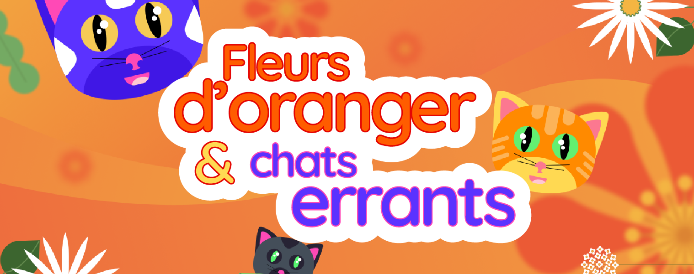
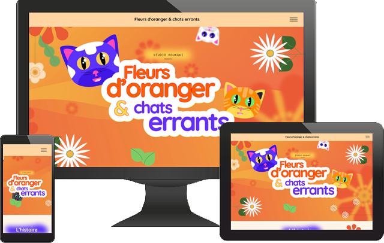

# Koukaki

**Projet 9 - Améliorer le site d'un studio d'animation avec JavaScript et des animations CSS** (parcours Developpeur Wordpress avec OpenClassrooms )

## Mission de ce projet

La mission est de dynamiser le site internet du studio d’animation Koukaki, dont le dernier film a été nominé aux Oscars du meilleur court-métrage d’animation !

## Déroulement du projet

1 - Installation de WordPress

2 - Mise en place de la sauvegarde

3 - Exploration du code pour voir comment cela fonctionne

4 - Activation du thème enfant et copie des premiers fichiers dont je vais avoir besoin

- footer.php

- front-page.php

- functions.php

- header.php

5 - Création du répertoir assets et à l'intérieur des répertoires

- css : pour y ajouter le fichier de style du thème

- fonts : pour ajouter les fonts de Google qui sont utilisées. A voir après pour les charger en local.

- images : avec les nouvelles images + récupération de toutes les images actuelles pour que tous les liens pointes au même endroit.

- js : pour y ajouter le script javacsript.

- video : pour y ajouter la vidéo du hero. A voir si on la laisse là.

6 - Création d'une simple page html avec tous les élements pour faire mes essais à blanc

7 - Puis, vient les étapes suivantes avec la mise en place

- de la vidéo dans la hero à la place du fond.

- de l'effet d'apparition de la vidéo et du logo titre.

- de l'effet d'apparition des sections.

- du comportement du logo titre quand on scroll vers le bas.

- de la rotation de toutes les fleurs (sauf celle où il y a les nuages car elles font partie de l'image de fond). A voir après pour accélérer la rotation des fleurs avec le scroll.

- changement du fond de la section "le lieu" et ajout des nuages avec un filtre blur sur ces derniers pour leur donner un aspect cotoneux. Je ferais le mouvement plus tard car il y a une contradiction entre Figma et le guide des étapes.

- ajout du comportement des titres h2 mais pour le moment activé quand on survol les sections concerné durant le scroll. A voir si c'est ce qui était demandé.

- création de la nouvelle section (oscar).

8 - Réintégration des modifications dans le thème enfant.

9 - Modification de l'effet d'apparition du logo titre et des différentes sections pour que cela soit uniquement géré par CSS.

10 - Mise en place de la fonction IntersectionObserver pour détecter quand les sections sont à l'affichage et ne déclencher l'effêt d'apparition en fade-in qu'à ce moment là

11 - Ajout d'une accéleration sur la rotation des fleurs quand on scroll.

12 - Repositionnement des fleurs dans le footer au niveau de la nouvelle section Oscar.

13 - Ajout de l'effet de tremblement sur le logo titre une fois qu'il est en place.

14 - Mise en place du déplacement vertical des nuages en fonction du scroll.

15 - Création d'un template avec un slider SWIPER pour afficher les personnages.

17 - Ajout de l'effet d'apparation des titres H2 et H3 quand on scroll vers le bas en utilisant la fonction IntersectionObserver pour déclencher l'effet.

18 - Modification de la nav bar :

- Mise en place d'un bouton hamburger à la place du menu qui fera ouvrir une page en plein écran.

- Mise en place d'une page modale pour afficher cette nouvelle page qui contient le menu.

- Ajout des décorations (chats + fleurs), selon les consignes de figma et avec les animations correspondantes (les chats flotent et les fleurs tournent).

19 - Ajustement et mise en place de médias query pour être responsif.

20 - Ajout de jQuery pour gérer l'apparition et la disparition de la modal pour le menu

21 - Modification de l'affichage des titres h3 et du logo titre en version portable : ils étaient affichés trop petit.

22 - Modifiaction de la gestion du fond du texte de la section des nominations.

23 - Modification de la gestion jQuery () : encapsuler la partie jQuery dans mon fichier JS avec
(function(\$) {
// code ici
})(jQuery);

24 - Ajout d'une page contact et d'une page RGPD

## Réalisation

[Le site "Koukaki" final en ligne](https://koukaki.stephane-mouron.fr/)
